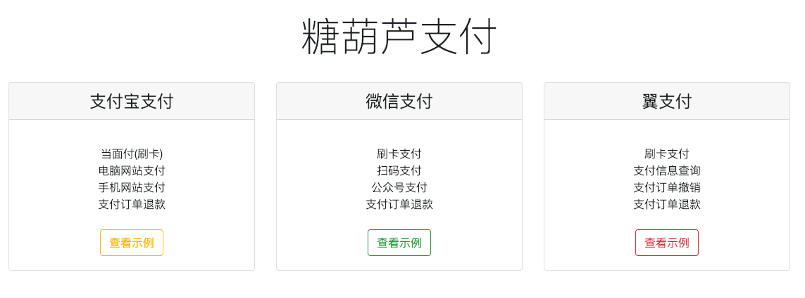

# 支付示例


- 在线Demo  [http://39.105.94.70:7171/](http://39.105.94.70:7171/)
- Github   [https://github.com/thlws/payment-thl](https://github.com/thlws/payment-thl)
- Gitee    [https://gitee.com/thlws/payment-thl](https://gitee.com/thlws/payment-thl)


## 微信示例
```java
package org.thlws.payment.simple.controller;

/**
 * The type Wechat pay controller.
 *
 * @author HanleyTang
 * @date 2018 -12-02
 */
@Controller
@RequestMapping("/wechat")
public class WechatPayController {

    private static final Log log = LogFactory.get();

    /**
     * 微信异步处理成功 返回数据.
     */
    public static final String XML_NOTIFY_OK = "<xml><return_code><![CDATA[SUCCESS]]></return_code><return_msg><![CDATA[处理成功]]></return_msg></xml>";

    /**
     * 微信异步处理失败 返回数据.
     */
    public static final String XML_NOTIFY_NG = "<xml><return_code><![CDATA[FAIL]]></return_code><return_msg><![CDATA[处理失败]]></return_msg></xml>";


    @Autowired
    private WechatConfig config;

    /**
     * 微信示例首页
     *
     * @return the string
     */
    @RequestMapping("/index")
    public String index(){
        return "wechat";
    }


    /**
     * 刷卡支付
     *
     * @param amt     the amt
     * @param barcode the barcode
     * @return the object
     */
    @RequestMapping(value = "/pay/micro_pay",produces = MediaType.APPLICATION_JSON_UTF8_VALUE)
    @ResponseBody
    public Object microPay(@RequestParam(name = "amt")String amt,
                           @RequestParam(name = "barcode")String barcode){
        try {
            WechatPayRequest request = new WechatPayRequest();
            request.setAppId(config.getAppid());
            request.setMchId(config.getMch_id());

            BigDecimal amount = new BigDecimal(amt);//测试金额
            System.out.println("amount="+amount);
            BigDecimal wechatAmt = amount.movePointRight(2);//微信单位为分，实际金额x100

            request.setSpbillCreateIp(NetUtil.getLocalhostStr());
            request.setTotalFee(wechatAmt.longValue()+"");//微信单位为分
            request.setAttach("attach data");
            request.setOutTradeNo(ThlwsBeanUtil.getRandomString(32));
            request.setAuthCode(barcode);
            request.setDeviceInfo("myDevice");
            request.setBody("pay test");

            WechatPayResponse response = WechatPayClient.microPay(request,config.getApi_key());
            return response;
        } catch (Exception e) {
            log.error("刷卡支付 microPay 付款失败",e);
            return e;
        }

    }


    /**
     * 需要异步处理,流程无法完整演示
     *
     * 扫描支付,官方叫native
     *
     * @param amt the amt
     * @return the object
     */
    @RequestMapping(value = "/pay/qrcode",produces = MediaType.IMAGE_PNG_VALUE)
    @ResponseBody
    public byte[] qrcode(@RequestParam(name = "amt")String amt){
        try {
            UnifiedOrderRequest request = new UnifiedOrderRequest();
            request.setAppId(config.getAppid());
            request.setMchId(config.getMch_id());

            BigDecimal amount = new BigDecimal(amt);//测试金额
            BigDecimal wechatAmt = amount.movePointRight(2);//微信单位为分，实际金额x100


            String body = "动态二维码支付测试";
            request.setBody(body);
            request.setOutTradeNo(System.currentTimeMillis()+"");
            request.setTotalFee(wechatAmt.longValue()+"");//微信单位为分
            request.setTradeType(WechatTradeType.NATIVE.type);
            request.setNotifyUrl("http://部署该服务的地址/wechat/notify");
            request.setSpbillCreateIp(NetUtil.getLocalhostStr());

            UnifiedOrderResponse response = WechatPayClient.unifiedOrder(request,config.getApi_key());
            String prepayId = response.getPrepayId();
            String imageContent = response.getCodeUrl();

            StringBuffer imgPath = new StringBuffer("/zone/temp/");
            File dir = new File(imgPath.toString());
            if (!dir.exists()){
                dir.mkdirs();
            }
            imgPath.append(prepayId).append(".png");

            ZxingUtil.qrCode(250,250,imageContent,"png",imgPath.toString());

            File img = new File(imgPath.toString());

            FileInputStream inputStream = new FileInputStream(img);
            byte[] bytes = new byte[inputStream.available()];
            inputStream.read(bytes, 0, inputStream.available());
            return bytes;

        } catch (Exception e) {
            log.error("扫码支付 qrcode 失败",e);
            return null;
        }

    }


    /****
     * 需要异步处理,公众号配置,流程无法演示
     *
     * 发起公众号支付,这里其实是公众号支付的数据准备阶段
     * 真正的支付在微信中调用微信JSSDK完成付款的.
     * @param amt the amt
     * @param modelMap the model map
     * @return object
     */
    @RequestMapping("/pay/mp")
    //@ResponseBody  //前后端分离模式需要直接返回JSON
    public Object mp(@RequestParam(name = "amt")String amt, ModelMap modelMap){
        try {

            UnifiedOrderRequest request = new UnifiedOrderRequest();
            request.setAppId(config.getAppid());
            request.setMchId(config.getMch_id());

            String outTradeNo = IdUtil.fastSimpleUUID();

            request.setOpenId("ofSpd1T-jkJ0UNzmHzDAd5Q2V_EM");
            // 1.若没有openId需要从微信中获取,使用如下方式生成微信规则URL用于得到openId
            // 2.WechatMpClient.generateWechatUrl(String appId, AuthorizeType scope, String callback, String bizData)
            // 3.得到openIdUrl后，返回到用户页面端，由用户发起请求,微信会自动回调我们填写的callback地址
            // 4.在回调地址callback中调用 WechatMpClient.obtainOauthAccessToken 就能得到openId，然后存储OpenId 下次付款就不用再获取了.
            // String callback = "微信回调地址"; 比如: http://wwww.xxx.com/wechat/openid
            // String bizData = "业务数据";//这里任意填写,最好使用有意义的值,在回调处理中可以得到微信参数.
            // String openIdUrl = WechatMpClient.generateWechatUrl(config.getAppid(), AuthorizeType.snsapi_base,callback,bizData);
            // return Result.ok("", DataType.url.value);


            BigDecimal amount = new BigDecimal(amt);//测试金额
            BigDecimal wechatAmt = amount.movePointRight(2);//微信单位为分，实际金额x100

            request.setBody("公众号支付测试");
            request.setOutTradeNo(outTradeNo);
            request.setTotalFee(wechatAmt.longValue()+"");//微信单位为分
            request.setTradeType(WechatTradeType.JSAPI.type);
            request.setNotifyUrl("http://部署该服务的地址/wechat/notify");
            request.setSpbillCreateIp(NetUtil.getLocalhostStr());

            UnifiedOrderResponse uResponse = WechatPayClient.unifiedOrder(request,config.getApi_key());

            MpPayment mPayment = new MpPayment();
            mPayment.setAppId(uResponse.getAppId());
            mPayment.setNonceStr(uResponse.getNonceStr());
            mPayment.setPackageStr("prepay_id=" + uResponse.getPrepayId());
            mPayment.setSignType("MD5");
            mPayment.setOutTradeNo(outTradeNo);
            mPayment.setTimeStamp(String.valueOf( System.currentTimeMillis() / 1000));
            mPayment.setPaySign(WechatUtil.sign(mPayment, config.getApi_key()));

            modelMap.addAttribute("mp", mPayment);

            //返回 支付数据, 如果是前后端分离的情况,需直接返回JSON格式支付数据,有前端开发人员处理.
            //return Result.ok(mPayment);

            //这里并非前后端分离方式,直接返回支付页面进行支付
            return "wechat_pay";

        } catch (Exception e) {
            log.error(e);
        }

        return null;
    }


    /**
     * 退款接口
     *
     * @param amt        the amt
     * @param outTradeNo the out trade no
     * @return the object
     */
    @RequestMapping(value = "/refund",produces = MediaType.APPLICATION_JSON_UTF8_VALUE)
    @ResponseBody
    public Object refund(@RequestParam(name = "amt")String amt,
                         @RequestParam(name = "out_trade_no")String outTradeNo){

        try {
            String p12FilePath = "微信p12秘钥文件";//

            log.debug("微信[退款]测试开始-WechatPayClient.refund");

            BigDecimal amount = new BigDecimal(amt);//测试金额
            BigDecimal wechatAmt = amount.movePointRight(2);//微信单位为分，实际金额x100

            WechatRefundRequest request = new WechatRefundRequest();
            request.setAppId(config.getAppid());
            request.setMchId(config.getMch_id());

            request.setOutTradeNo(outTradeNo);
            request.setOutRefundNo(ThlwsBeanUtil.getRandomString(24));
            request.setTotalFee(wechatAmt.longValue()+"");//微信单位为分
            request.setRefundFee(wechatAmt.longValue()+"");

            WechatRefundResponse response = WechatPayClient.refund(request,config.getApi_key(),p12FilePath);
            return  response;
        } catch (Exception e) {
           log.error("微信退款失败",e);
           return e;
        }

    }


    /**
     * 得到OpenId.
     *
     * @param request the request
     * @return the object
     */
    @RequestMapping(value = "/openid", produces = MediaType.TEXT_HTML_VALUE)//直接返回一个URL自动跳转
    @ResponseBody
    public Object openId(HttpServletRequest request) {

        try {
            String code = request.getParameter("code");
            String bizData = request.getParameter("state");

            //FIXME 根据 bizData 得到 appId ,secret
            String appId="";
            String secret = "";

            MpObtainOauthTokenRequest oauthTokenRequest = new MpObtainOauthTokenRequest();
            oauthTokenRequest.setAppid(appId);
            oauthTokenRequest.setCode(code);
            oauthTokenRequest.setSecret(secret);
            MpOauthTokenResponse oauthTokenResponse = WechatMpClient.obtainOauthAccessToken(oauthTokenRequest);
            String openId = oauthTokenResponse.getOpenid();

            //TODO 存储 OpenId 到系统中
            //TODO 再返回前端页面,重新发起付款流程.
            return WechatUrlUtil.scriptUrl("前端页面URL");//前端会自动跳转到该页面.

        } catch (Exception e) {
            log.error("OpenId获取失败,error",e);
            return e;
        }

    }


    /**
     * 异步处理,流程无法演示
     *
     * 微信支付异步数据处理.
     *
     * @param request  the request
     * @param response the response
     */
    @RequestMapping("/notify")
    public void notify(HttpServletRequest request, HttpServletResponse response){

        PrintWriter writer = null;

        try {
            writer = response.getWriter();
            String notifyMsgToXml = WechatUtil.parseNotifyMsgToXml(request);
            NotifyResponse nResponse = WechatUtil.parseNotifyMsgToBean(notifyMsgToXml);
            String outTradeNo = nResponse.getOut_trade_no();
            String transactionId = nResponse.getTransaction_id();
            //FIXME 这里需要根据 outTradeNo 标识该笔支付已经成功，并补填微信平台支付单号transactionId.
            writer.println(XML_NOTIFY_OK);
        } catch (Exception e) {
            log.error("异步处理失败",e);
            //注意如果返回NG,微信间隔一段时间会再次进行通知,记得必要时需要进行处理
            //比如连续3词都失败了，在系统记录数据，直接返回微信OK标识,然后人为介入排查原因.
            writer.println(XML_NOTIFY_NG);
        }

    }

}

```

## 支付宝示例
```java
package org.thlws.payment.simple.controller;

import cn.hutool.log.Log;
import cn.hutool.log.LogFactory;
import com.alipay.api.AlipayConstants;
import org.springframework.beans.factory.annotation.Autowired;
import org.springframework.http.MediaType;
import org.springframework.stereotype.Controller;
import org.springframework.ui.ModelMap;
import org.springframework.web.bind.annotation.RequestMapping;
import org.springframework.web.bind.annotation.RequestParam;
import org.springframework.web.bind.annotation.ResponseBody;
import org.thlws.payment.AlipayClient;
import org.thlws.payment.alipay.core.AlipayCore;
import org.thlws.payment.alipay.entity.request.AlipayMobileSiteRequest;
import org.thlws.payment.alipay.entity.request.AlipayRefundRequest;
import org.thlws.payment.alipay.entity.request.AlipayTradeRequest;
import org.thlws.payment.alipay.entity.request.AlipayWebSiteRequest;
import org.thlws.payment.alipay.entity.response.AlipayRefundResponse;
import org.thlws.payment.alipay.entity.response.AlipayTradeResponse;
import org.thlws.payment.simple.config.AlipayConfig;

import javax.servlet.http.HttpServletRequest;
import java.util.Enumeration;

/**
 * 支付宝支付示例.
 * FIXME 示例中 [手机+电脑] 网站支付暂不可用,我这里没有进行相关配置而已。
 * @author HanleyTang
 * @date 2018 -12-02
 */
@Controller
@RequestMapping("/alipay")
public class AlipayController {

    private static final Log log = LogFactory.get();

    @Autowired
    private AlipayConfig alipayConfig;

    /**
     * 支付宝付款测试页.
     *
     * @return the string
     */
    @RequestMapping("/index")
    public String index(){
        return "alipay";
    }

    /**
     * 当面付.
     * 用于线下POS，线上一般不会这么用
     *
     * @param amt     the amt
     * @param barcode the barcode
     * @return the object
     */
    @RequestMapping(value = "/pay/f2f",produces = MediaType.APPLICATION_JSON_UTF8_VALUE)
    @ResponseBody
    public Object payFaceToFace(@RequestParam(name = "amt")String amt,
                                @RequestParam(name = "barcode")String barcode){
        try {
            AlipayCore.ClientBuilder clientBuilder = new AlipayCore.ClientBuilder();
            AlipayCore alipayCore = clientBuilder.setAlipayPublicKey(alipayConfig.getAlipay_public_key())
                    .setAppId(alipayConfig.getAppid())
                    .setPrivateKey(alipayConfig.getPrivate_key())
                    .setSignType(AlipayConstants.SIGN_TYPE_RSA2).build();

            AlipayTradeRequest request = new AlipayTradeRequest();
            request.setTotalAmount(amt);
            request.setStoreId("myStoreId001");
            request.setOperatorId("007");
            request.setAuthCode(barcode);
            request.setOutTradeNo(System.currentTimeMillis()+"");
            request.setSubject("测试当面付");
            AlipayTradeResponse response = AlipayClient.pay(request,alipayCore);
            return response;
        } catch (Exception e) {
            log.error("当面付失败",e);
            return e;
        }

    }

    /**
     * 手机网站支付. FIXME 暂不可用
     * 在手机浏览器打开(不能在微信中)完成付款动作.
     *
     * @param amt      the amt
     * @param modelMap the model map
     * @return the string
     */
    @RequestMapping("/pay/mobile")
    public String payInMobileSite(@RequestParam(name = "amt",defaultValue = "0.01")String amt,
                                  ModelMap modelMap){

        try {
            AlipayCore.ClientBuilder clientBuilder = new AlipayCore.ClientBuilder();
            AlipayCore alipayCore = clientBuilder.setAlipayPublicKey(alipayConfig.getAlipay_public_key())
                    .setAppId(alipayConfig.getAppid())
                    .setPrivateKey(alipayConfig.getPrivate_key())
                    .setSignType(AlipayConstants.SIGN_TYPE_RSA2).build();

            AlipayMobileSiteRequest request = new AlipayMobileSiteRequest();
            request.setNotifyUrl("http://你的异步处理地址/alipay/notify_mobile");
            request.setReturnUrl("http://你的同步处理地址/alipay/alipay_sync_mobile");
            AlipayMobileSiteRequest.BizContent bizContent = new AlipayMobileSiteRequest.BizContent();
            bizContent.setTotalAmount(amt);
            bizContent.setSubject("测试H5(手机网页)支付");
            //bizContent.setSeller_id(partner_id);
            bizContent.setProductCode("p0001");
            bizContent.setOutTradeNo(System.currentTimeMillis()+"");
            request.setBizContent(bizContent);
            String html = AlipayClient.payInMobileSite(request,alipayCore);
            modelMap.addAttribute("form", html);
        } catch (Exception e) {
            log.error("手机网站支付失败",e);
        }
        return "alipay/alipay_mobile";
    }

    /**
     * 电脑网站支付.FIXME 暂不可用
     *
     * @param amt      the amt
     * @param modelMap the model map
     * @return the string
     */
    @RequestMapping("/pay/web")
    public String payInWebSite(@RequestParam(name = "amt",defaultValue = "0.01")String amt,
                               ModelMap modelMap){
        try {
            AlipayCore.ClientBuilder clientBuilder = new AlipayCore.ClientBuilder();
            AlipayCore alipayCore = clientBuilder.setAlipayPublicKey(alipayConfig.getAlipay_public_key())
                    .setAppId(alipayConfig.getAppid())
                    .setPrivateKey(alipayConfig.getPrivate_key())
                    .setSignType(AlipayConstants.SIGN_TYPE_RSA2).build();

            AlipayWebSiteRequest request = new AlipayWebSiteRequest();
            request.setNotifyUrl("http://你的异步处理地址/alipay/notify_mobile");
            request.setReturnUrl("http://你的同步处理地址/alipay/alipay_sync_web");
            AlipayWebSiteRequest.BizContent bizContent = new AlipayWebSiteRequest.BizContent();
            bizContent.setTotalAmount(amt);
            bizContent.setSubject("测试电脑网站支付");
            bizContent.setBody("测试");
            bizContent.setProductCode("p0001");
            bizContent.setOutTradeNo(System.currentTimeMillis()+"");
            String html = AlipayClient.payInWebSite(request,alipayCore);
            modelMap.addAttribute("form", html);

        } catch (Exception e) {
            log.error("电脑网站支付失败",e);
        }

        return "alipay/alipay_web";
    }

    /**
     * 退款,适用所有付款方式.
     *
     * @param amt        the amt
     * @param outTradeNo the out trade no
     * @return the object
     */
    @RequestMapping(value = "/refund",produces = MediaType.APPLICATION_JSON_UTF8_VALUE)
    @ResponseBody
    public Object refund(@RequestParam(name = "amt")String amt,
                         @RequestParam(name = "out_trade_no")String outTradeNo){

        try {
            AlipayCore.ClientBuilder clientBuilder = new AlipayCore.ClientBuilder();
            AlipayCore alipayCore = clientBuilder.setAlipayPublicKey(alipayConfig.getAlipay_public_key())
                    .setAppId(alipayConfig.getAppid())
                    .setPrivateKey(alipayConfig.getPrivate_key())
                    .setSignType(AlipayConstants.SIGN_TYPE_RSA2).build();

            AlipayRefundRequest request = new AlipayRefundRequest();
            request.setTradeNo(outTradeNo);
            request.setRefundAmount(amt);
            request.setRefundReason("测试退款");
            AlipayRefundResponse response = AlipayClient.refund(request,alipayCore);
            return response;
        } catch (Exception e) {
            log.error("支付宝退款失败.",e);
            return e;
        }
    }


    /**
     * 手机网站支付同步跳转页面
     *
     * @param request the request
     * @return the string
     */
    @RequestMapping("/alipay_sync_mobile")
    public String sync_mobile(HttpServletRequest request){

        System.out.println("================sync_mobile===================");
        Enumeration<String> its = request.getParameterNames();
        while (its.hasMoreElements()){
            String name = its.nextElement();
            System.out.println("name = [" + name + "]");
        }
        System.out.println("================sync_mobile===================");
        return "alipay/alipay_sync_mobile";
    }


    /**
     * 电脑网站支付同步跳转页面.
     */
    @RequestMapping("/alipay_sync_web")
    public String sync_web(HttpServletRequest request){
        System.out.println("==============sync_web=====================");
        Enumeration<String> its = request.getParameterNames();
        while (its.hasMoreElements()){
            String name = its.nextElement();
            System.out.println("name = [" + name + "]");
        }
        System.out.println("===============sync_web====================");
        return "alipay/alipay_sync_web";
    }

}
```

## 翼支付示例
```java

/**
 * 翼支付
 *
 * @author HanleyTang
 * @date 2018 -12-02
 */
@Controller
@RequestMapping("/bestpay")
public class BestpayController {

    private final Logger logger = LoggerFactory.getLogger(getClass());

    @Autowired
    private BestpayConfig config;

    /**
     * Index string.
     *
     * @return the string
     */
    @RequestMapping("/index")
    public String index(){
        return "bestpay";
    }


    /**
     * 适用线下POS付款，类似沃尔玛 店员扫码用户手机完成付款(用户需要安装翼支付App)
     * 线上环境一般不会这么使用。
     * @param amt     the amt
     * @param barcode the barcode
     * @return the object
     */
    @RequestMapping(value = "/pay",produces = MediaType.APPLICATION_JSON_UTF8_VALUE)
    @ResponseBody
    public Object pay(@RequestParam(name = "amt")String amt,
                      @RequestParam(name = "barcode")String barcode){

        try {
            //单位为分
            String amount = new BigDecimal(amt).movePointRight(2).longValue()+"";

            BarcodePayRequest request = new BarcodePayRequest();
            request.setMerchantId(config.getMerchant_id());
            request.setBarcode(barcode);
            request.setOrderNo(IdUtil.fastSimpleUUID());
            request.setOrderReqNo(IdUtil.fastSimpleUUID());//交易流水号
            request.setOrderDate(DateUtil.format(new Date(),DatePattern.PURE_DATETIME_PATTERN));
            request.setOrderAmt(amount);
            request.setProductAmt(amount);
            request.setGoodsName("测试商品");
            request.setStoreId("20191008");
            OrderResultResponse response = BestPayClient.barcode(request, config.getKey());
            return response;
        } catch (Exception e) {
            logger.error("翼支付付款失败",e);
            return e;
        }

    }


    /**
     * 查询翼支付付款详情
     *
     * @param orderNo the order no
     * @return the object
     */
    @RequestMapping(value = "/query",produces = MediaType.APPLICATION_JSON_UTF8_VALUE)
    @ResponseBody
    public Object query(@RequestParam(name = "orderNo")String orderNo,
                        @RequestParam(name = "reqNo")String reqNo){


        try {
            QueryOrderRequest request = new QueryOrderRequest();
            request.setMerchantId(config.getMerchant_id());
            request.setOrderNo(orderNo);//FIXME 支付单号：QueryOrderRequest.orderNo
            request.setOrderReqNo(reqNo);//FIXME  支付请求号 QueryOrderRequest.orderReqNo
            request.setOrderDate(DateUtil.format(new Date(),DatePattern.PURE_DATETIME_PATTERN));

            OrderResultResponse response = BestPayClient.query(request, config.getKey());
            return response;
        } catch (Exception e) {
            logger.error("翼支付查询失败",e);
            return e;
        }
    }


    /**
     * 撤销支付订单.
     *
     * @param orderNo the order no
     * @return the object
     */
    @RequestMapping(value = "/reverse",produces = MediaType.APPLICATION_JSON_UTF8_VALUE)
    @ResponseBody
    public Object reverse(@RequestParam(name = "orderNo")String orderNo,
                          @RequestParam(name = "reqNo")String reqNo,
                          @RequestParam(name = "amt",defaultValue = "0.01")String amt){

        try {

            //单位为分
            String amount = new BigDecimal(amt).movePointRight(2).longValue()+"";

            OrderReverseRequest request = new OrderReverseRequest();
            request.setMerchantId(config.getMerchant_id());
            request.setMerchantPwd(config.getMerchant_pwd());
            request.setOldOrderNo(orderNo);//FIXME 支付单号：QueryOrderRequest.orderNo
            request.setOldOrderReqNo(reqNo);//FIXME  支付请求号 QueryOrderRequest.orderReqNo
            request.setRefundReqNo(IdUtil.fastSimpleUUID());
            request.setRefundReqDate(DateUtil.format(DateUtil.date(), DatePattern.PURE_DATE_PATTERN));
            request.setTransAmt(amount);

            OrderReverseResponse response = BestPayClient.reverse(request, config.getKey());
            return response;
        } catch (Exception e) {
            logger.error("翼支付撤销失败",e);
            return e;
        }
    }


    /**
     * 退款
     *
     * @param orderNo the order no
     * @return the object
     */
    @RequestMapping(value = "/refund",produces = MediaType.APPLICATION_JSON_UTF8_VALUE)
    @ResponseBody
    public Object refund(@RequestParam(name = "orderNo")String orderNo,
                         @RequestParam(name = "reqNo")String reqNo,
                         @RequestParam(name = "amt",defaultValue = "0.01")String amt){

        try {


            //单位为分
            String amount = new BigDecimal(amt).movePointRight(2).longValue()+"";

            OrderRefundRequest request = new OrderRefundRequest();
            request.setMerchantId(config.getMerchant_id());
            request.setOldOrderNo(orderNo);//FIXME 支付单号：QueryOrderRequest.orderNo
            request.setOldOrderReqNo(reqNo);//FIXME  支付请求号 QueryOrderRequest.orderReqNo
            request.setMerchantPwd(config.getMerchant_pwd());
            request.setRefundReqDate(DateUtil.format(DateUtil.date(), DatePattern.PURE_DATE_PATTERN));
            request.setRefundReqNo(RandomUtil.randomNumbers(16));
            request.setTransAmt(amount);

            OrderRefundResponse response = BestPayClient.refund(request, config.getKey());
            return response;
        } catch (Exception e) {
            logger.error("翼支付退款失败",e);
            return e;
        }
    }


}

```